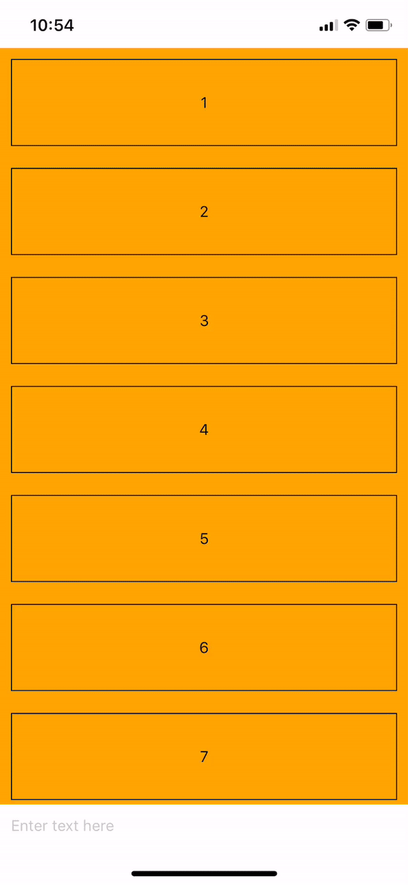

You can directly try out the [snack](https://snack.expo.io/@jarvisluong/keyboard-avoiding-chat-input):

You want to build a chat app in React Native and you are now trying to make the chat input goes up with the keyboard. There are so many solutions out there with guides but you haven’t found your sweet spot, something like this:

`TextInput` field goes up with the keyboard nicely :)

React Native ships with a component called `KeyboardAvoidingView`. What it does is simply changing its layout according to the keyboard. This component provides us with 3 different behaviors of changing its layout. For me, using “padding” gives the most predictable outcomes. Basically, when keyboard goes up, this component will add padding to the area that keyboard covers and that moves it’s children up.

`gist:jarvisluong/5d5f68b2dd61337613e2d3a2b911a6ac#chat-input-keyboard-aware.js`

Content will be placed inside a `KeyboardAvoidingView` in which the elements will be placed to the end of the view (and on top of the keyboard when it goes up)

Using a will yield an effect that can tap outside the keyboard to dismiss it, which is popular in chat apps.

That’s just how simple it is! Enjoy!
