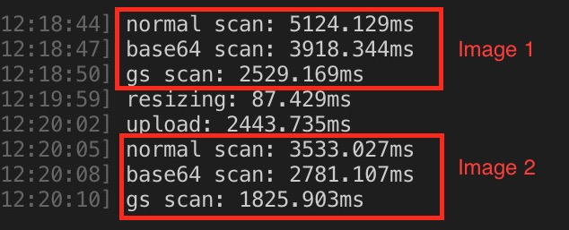

Google Vision API is an image content analysis online service where you can upload your image and Google's AI will then analyze it and return back to you the results of texts, objects it found on the image. you can visit this link to learn more: https://cloud.google.com/vision/ (they even have a live demo where you can directly try uploading one image and see what it can do.

> Even though this blog is mainly experimenting with the Google Vision service, I am certain that some of the results will also be applied to other equivalent image analysis services such as Amazon Rekognition (https://aws.amazon.com/rekognition/) or Microsoft Cognitive Services (https://azure.microsoft.com/en-us/services/cognitive-services/).

Last month I and my colleagues were working on improving the latency time waiting for the Google Vision API processing our uploaded images to extract text blocks. Including the post-processing time for Google's returned data, ~7-14 seconds is the duration each time an image is analyzed, in which more than 60% is waiting for Google Vision API to complete analyzing the image and return the data back. We decided this was inefficient and tried to reduce the waiting time.

There are three options to upload images to Google Vision:

- Directly upload the image as binary
- Upload the image as base64 encoded
- Use a pre-uploaded image stored on Google Cloud Storage (https://cloud.google.com/storage/)

After experimenting and record the time taken to analyze two images using those three different methods, we came to an amazing result. The experiment was conducted using the same client and network condition:

> (In the screenshot, normal scan means uploading image as binary, base64 scan means upload image as base64 format and gs scan means using a pre-uploaded image in Google Cloud Storage)

As we can see, uploading the image directly as the binary is slowest, then uploading with base64 encoded image is ~25% faster. However, using the pre-uploaded image stored on Google Cloud Storage yields 50% faster analysis time. This gives the following conclusion:

If you are not frequently using the Google Cloud Storage service to store the images, then you should encode the image to base64 format and use it for Google Vision API. Otherwise, the incentive is very much huge to use the pre-uploaded image for Google Vision API.
