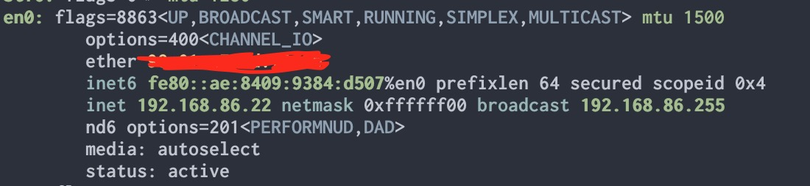
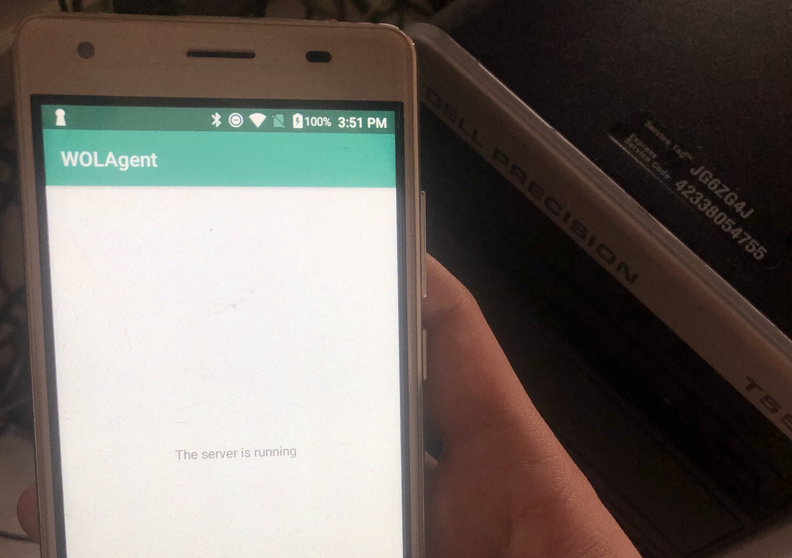
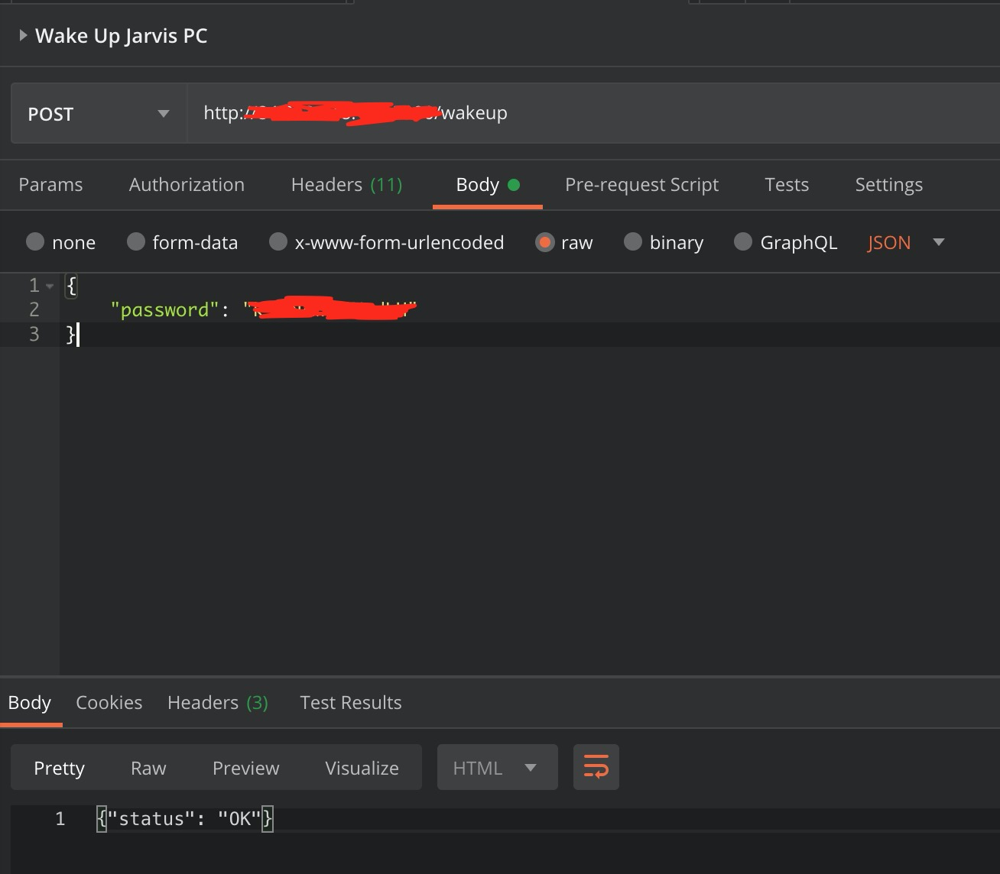

**Important**: This blog requires the reader to have some knowledge in BIOS settings, network communication (i.e ports, TCP/UDP), and a little bit of scripting skill.

It would be convenient and also cool if you can have access to your own PC when you are not at home, whether through your phone or your laptop. One easy way could be leaving your PC to always turned on and, for example, install Team Viewer on it. That sounds inefficient isn't it? What if there is a way to leave your PC turned off when you don't need, and have the ability to turn it on, **remotely**, when you require.

Fortunately, it is possible through a couple of techniques, which are:

1. Wake on LAN (which allows turning on a device remotely)
2. Local Port Forwarding (which allows a device at home to receive a signal from the Internet), and,
3. Connect via VNC server (which is equivalent to Team Viewer, except it is open source and allows you to customize it)

### Enable Wake-On-Lan (WOL)

Wake on LAN is "a computer networking standard which allows a computer to be turned on or awaken by a network message". How it works in simple term is:

Send a target device in the same Local Area Network (LAN, which can be your home wifi or hotspot) with a special message.
There are some ready-made programs (both native and web-based) and command-line interfaces such as [wakeonlan cli](https://github.com/jpoliv/wakeonlan), [Wake on Lan Android](https://play.google.com/store/apps/details?id=co.uk.mrwebb.wakeonlan&hl=en). However, this protocol only works for Ethernet-based network devices, so please take note!

In order to enable Wake on LAN on your PC, first, you need to make sure that your BIOS supports this feature. Simply turn on the computer, press a special key (in my PC it is F12) to do to BIOS settings and you should be able to find that option.

Then, you will need to know the MAC address of the network device which your PC has, simply run this command in your PC (if it is Linux, for other OSes there should be a similar option):

```bash
ifconfig
```

Most of the time, it would be "en0" and you can see the MAC address like the below screenshot (I need to censor it obviously)



After that, you can try to run this command in another device with the same network and voila, see your PC turning up like magic:

```bash
wakeonlan <THE MAC ADDRESS>
```

You should see:

```bash
Sending magic packet to 255.255.255.255:9 with <THE MAC ADDRESS>
```

The "255.255.255.255" is the broadcast address, which means that the message will be sent to all the devices in the same network, and the ":9" is the port number that listens to the wake-on-lan command. 9 is the most popular port, but it can be 7 in some cases.

One downside is, this method can only be applied through a local network. If you go outside of your home network, you won't be able to do what listed above. So how can we solve this?

### Port forwarding

From the previous part, we see that in order to achieve the wake-on-lan feature, we need another device in the same network to send a "magic signal" to port 9 of your PC. To do this remotely (which is outside your home network), you can for example set up a method in which you can control that "another device".

We all know what there is a thing called "router" in your home that helps to communicate with the outer Internet and your devices. Interestingly, the "router" itself has other features than just giving you access to the Internet. The features which you will need are IP & MAC binding, DHCP Address Reservation, and Port forwarding.

- IP & MAC binding: This links the MAC Address of the Network Card to a chosen IP so the router knows to send the packet to the Network Card even when the PC is offline
- DHCP Address Reservation: This ensures that the PC gets assigned the same IP address every time it comes online.
- Port Forwarding: This redirects a request coming from WAN (public IP address) to the chosen IP above.

Unfortunately, my router does not have all the above features (only Port Forwarding and DHCP Address Reservation is possible), so I need to come up with another workaround... I have a spare Android device at home, so I set it up as a web server which listens to incoming HTTP requests. Once the request matches what I pre-configured, it will send the wake-on-lan message to the PC in the same network



In order to do that, I need to quickly write a small Android application that serves an HTTP server (in my case, I expose to port 5000). The source code can be found here: https://github.com/jarvisluong/wake-on-lan-agent
Then I reserve a static local IP for my android phone and forward a public port to that phone's port 5000. Now I can even use Postman to test if it works :D.



### Remote control via VNC

Now we can turn on the PC whenever we want, we should be able to control it also (downloading files, running programs, browsing the web, ...). If you don't need these features, a simple ssh connection to your PC will suffice for various tasks (and really capable in fact).

A powerful solution is to use VNC, and there are lots of options, which in my case I use vnc4server

(my PC is running a Linux distro based on Ubuntu 18.04, and use lightdm as the desktop manager). I simply add the following configuration:

```conf
# /etc/lightdm/lightdm.conf.d/vnc.conf
[VNCServer]
enabled=true
command=Xvnc -rfbauth /etc/vncpasswd # You need to run vncpasswd first to get this password file
port=5900
listen-address=localhost
width=1024
height=768
depth=24
```

Since VNC connection is unencrypted, it is recommended to access the vnc server through SSH tunneling, for example:

```bash
ssh username@host -L 5900:127.0.0.1:5900
```

I hope this write up will help anyone who is curious about this same topic. At the same time, feel free to comment below if you find something which can be improved, or questions which I can answer. Happy hacking!

# Reference:

- https://en.wikipedia.org/wiki/Wake-on-LAN
- https://superuser.com/questions/1332871/port-forwarding-not-working-for-port-9
