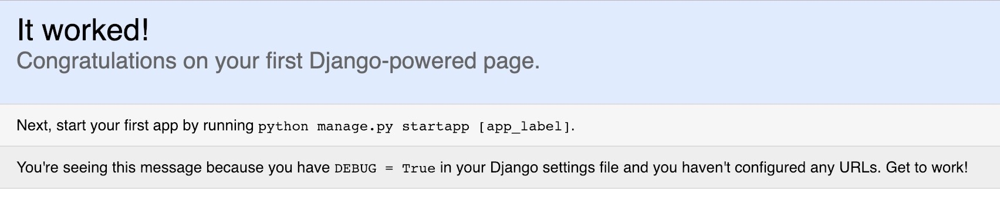
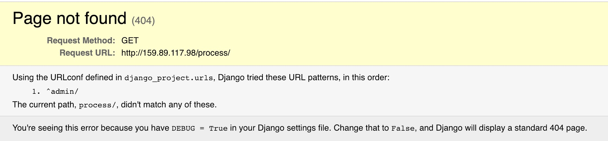
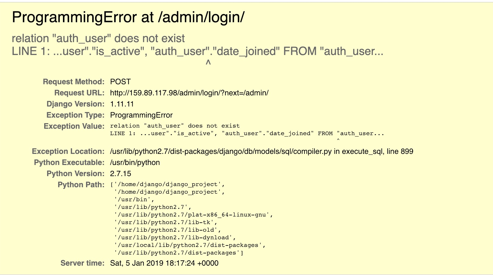

I have always been curious about how a scam site is developed and delivered to the victims. During my holiday in Canada, my girlfriend told me about some scam SMS being sent to her and her friends. Hmm, this is my chance to do some experiments! So I asked her to forward me those SMSes. Those are the messages:

```
Canada Revenue Agency sent your monthly return.
Deposit your funds below:
http://139.59.91.94/SOH
```

```
Canada Revenue Agency sent your monthly return.
Deposit your funds below:
http://159.89.117.98/process/
```

Before going forward, those servers are harmless so you can even follow the steps I took in this post. However, I won't guarantee the result will be the same. Those servers may be updated and even be harmful!!!. Proceed with your own caution!

It seems that those SMSes have a template. I wonder why the scammer won't spend more time to craft better scam content. And if the scammer is serious about making some money, they should mask the IP behind some free domain like "canada.xyz" or whatever. No one likes to read those bogus numbers and would certainly feel hesitant to click the link.

I will be using Postman (https://www.getpostman.com/) to do the experiment. My first guess will just try to make some GET call (just like how normal person would access them through browsers). Since GET calls are quite safe, I won't be scammed, yet lol.

For the first SMS, I took the IP address 139.59.91.94 and try to make a GET to the root route ("/") and postman said it cannot found any response. It seems that this scam server was down, so sad :(. I then proceed to the second SMS.

When making the GET request to the root route, I can see this is the default UI of a Django application!



Interestingly, as I can see from the site, it says this Django app is in DEBUG mode. This means all information about settings, routes, and error will be available to inspect. Django developers strongly advise against making DEBUG mode when running a server in production mode, which is ready for end-user to use (https://security.stackexchange.com/questions/1180/is-there-a-security-risk-running-web-apps-in-debug-true). Hmm, so secure for a scam site?

I feel that this server is harmless, so I then go straight to access the server through browser to the exact URL that is in the SMS. Interestingly, that link does not exist anymore! Instead, Django helped me to find corrects URL for this server:



This means the server only has routes to the admin panel (default routes for a
Django application). This is weird, did the scammer just push a default
application and do nothing?. I would still go to the admin panel then. The site
prompts me to login as an administrator. Let's just use the most default
credentials then:

```
username: admin
password: admin
```

Sadly, the site throws an error, again:



This means that the dude who runs this server didn't run any migration scripts when deploying the site (https://docs.djangoproject.com/en/2.1/topics/migrations/)! This is an important step for a Django app to work properly. Well, so much for a scam site! (This site won't do any meaningful work, even harmful or useful one).
